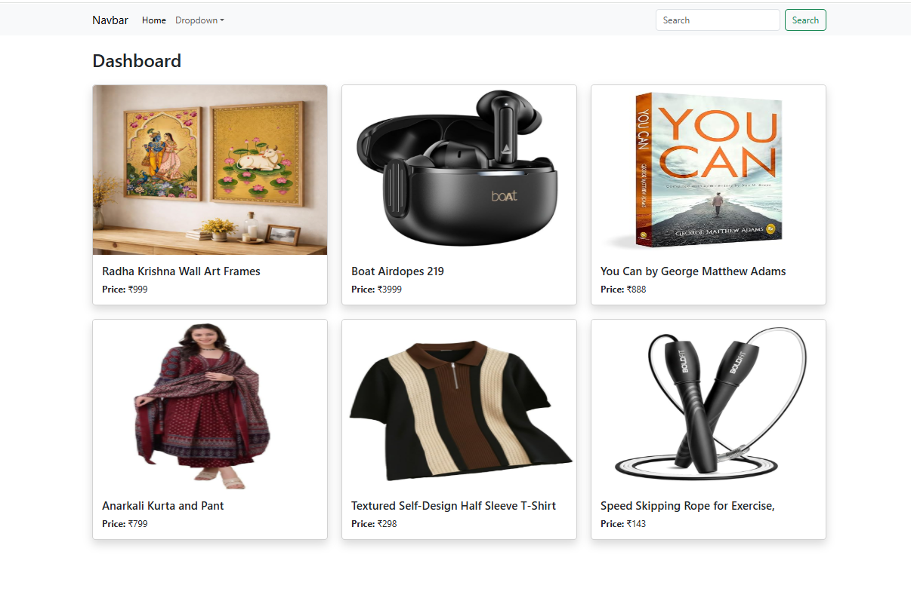
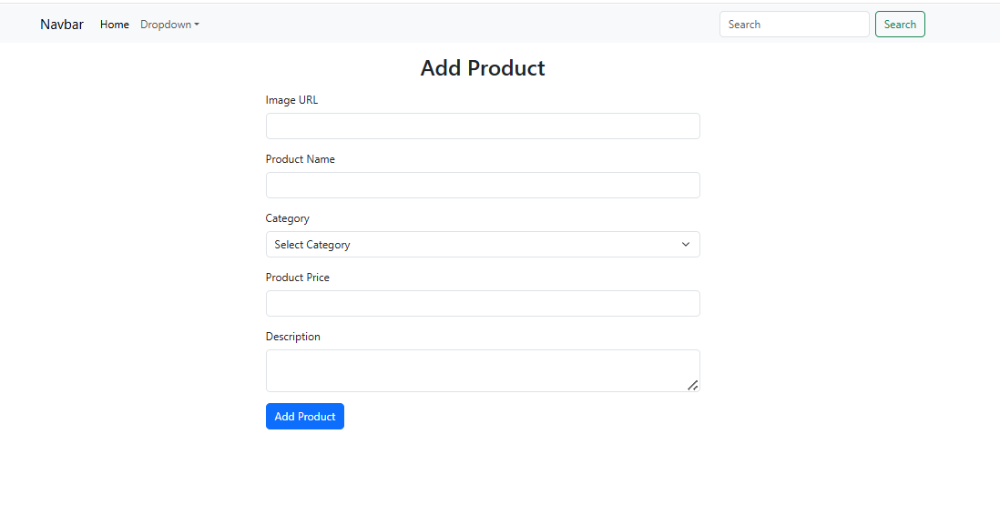
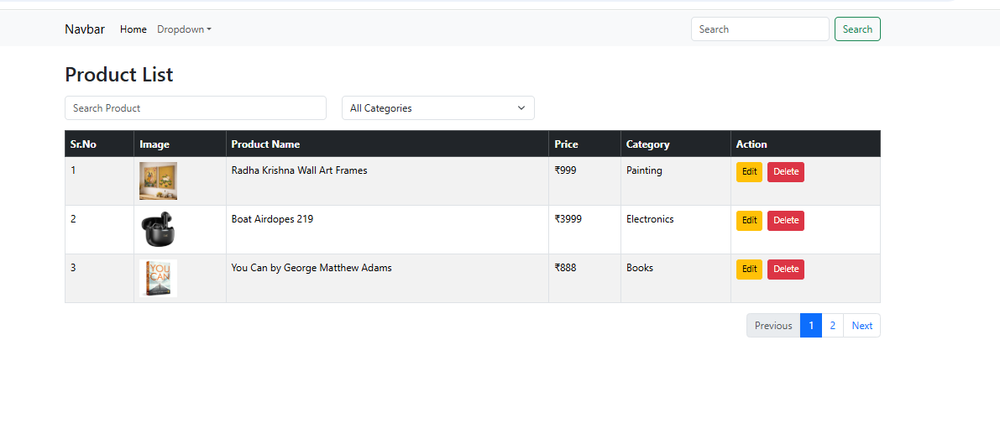
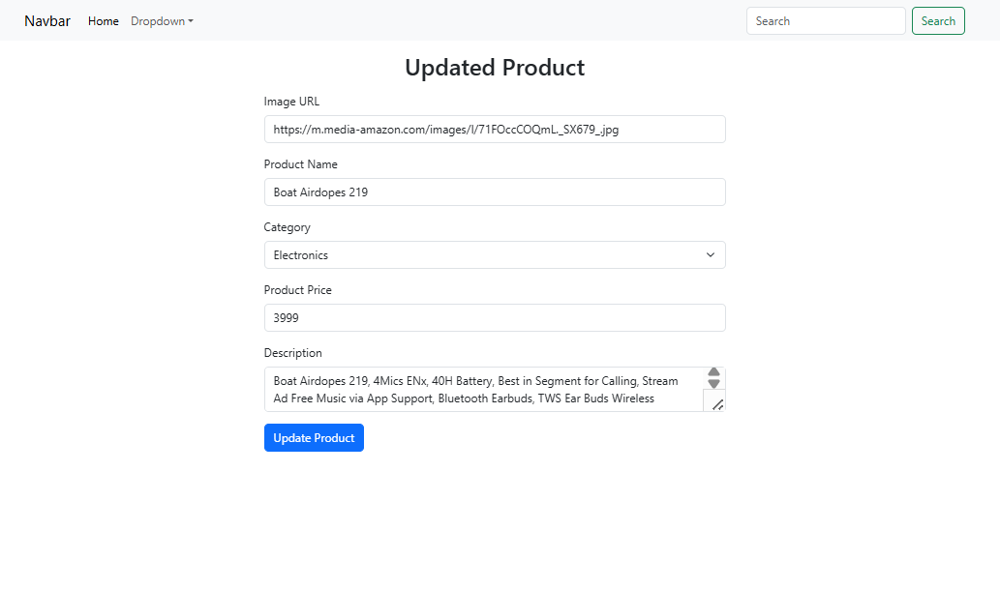
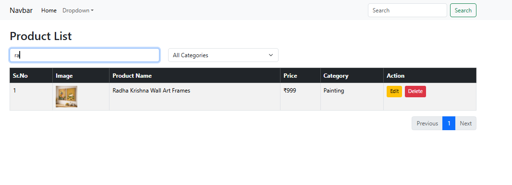
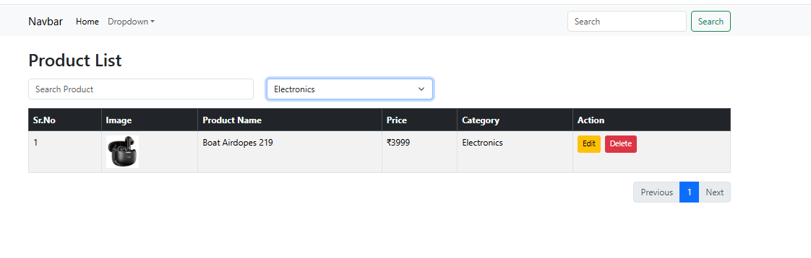

# 📊 Data Table Management System

A modern React.js application that allows users to manage records efficiently through CRUD operations, search functionality, pagination, form validation, and local storage integration.

---

## 🚀 Project Overview

The Data Table Management System is developed using React.js to demonstrate practical implementation of front-end development concepts. The application enables users to add, edit, update, delete, search, and manage records dynamically while maintaining data persistence using Local Storage.

This project focuses on creating a responsive and user-friendly interface for handling structured data efficiently.

---

## ✨ Features

### 🔹 CRUD Operations

* Add new records
* Edit existing records
* Update data dynamically
* Delete records instantly

### 🔹 Search Functionality

* Search records dynamically
* Real-time filtering of table data

### 🔹 Pagination

* Display limited records per page
* Navigate between pages efficiently

### 🔹 Form Validation

* Required field validation
* Error handling and user feedback

### 🔹 Local Storage Integration

* Persistent data storage
* Data remains available after browser refresh

### 🔹 Toast Notifications

* Success messages
* Update notifications
* Delete confirmations

### 🔹 Responsive Design

* Mobile-friendly layout
* Bootstrap-based UI components

---

## 🛠️ Technologies Used

| Technology        | Purpose              |
| ----------------- | -------------------- |
| React.js          | Frontend Development |
| JavaScript (ES6+) | Application Logic    |
| Bootstrap 5       | UI Design            |
| React Router DOM  | Navigation           |
| React Toastify    | Notifications        |
| Local Storage     | Data Persistence     |
| HTML5             | Structure            |
| CSS3              | Styling              |

---

## 📂 Project Structure

```bash

src
│
├── Components
│   ├── Header.jsx
│
├── Pages
│   ├── Add_Data.jsx
│   ├── View_Data.jsx
│   ├── Dashboard.jsx
│
├── App.jsx
├── main.jsx
└── index.css

```

---

## ⚙️ Installation & Setup

### Clone Repository

```bash

git clone https://github.com/dev-dhamandadiya/pr-8-Data-Table-react.js.git

```

### Navigate to Project

```bash

cd pr-8-Data-Table-react.js

```

### Install Dependencies

```bash

npm install

```

### Run Project

```bash

npm run dev

```

---

## 📸 Screenshots

### 🏠 Dashboard



---

### ➕ Add Product



---

### 📋 View Products



---

### ✏️ Update Product



---

### 🔍 Search Functionality



---

### 🗂️ Category Filter



---

### 📄 Pagination


---

## 🎥 Project Demonstration Video

[▶ Watch Demo Video](https://drive.google.com/your-video-link)
```

---

## 🔄 Project Workflow

1. User enters data through the form.
2. Validation checks required fields.
3. Data is stored in Local Storage.
4. Records are displayed in the data table.
5. Search filters records dynamically.
6. Pagination manages large datasets.
7. Edit and Delete operations update records.
8. Toast notifications provide user feedback.

---

## 📚 Learning Outcomes

Through this project, the following React concepts were implemented:

* Functional Components
* useState Hook
* useEffect Hook
* Event Handling
* Conditional Rendering
* Form Handling
* CRUD Operations
* Search Logic
* Pagination Logic
* Local Storage Management
* React Router Navigation
* Toast Notifications

---

## 🎯 Conclusion

The Data Table Management System successfully demonstrates modern React.js development practices through CRUD operations, search functionality, pagination, validation, and Local Storage integration. The project provides a practical understanding of state management, component-based architecture, and dynamic user interactions while delivering an intuitive and responsive user experience.
